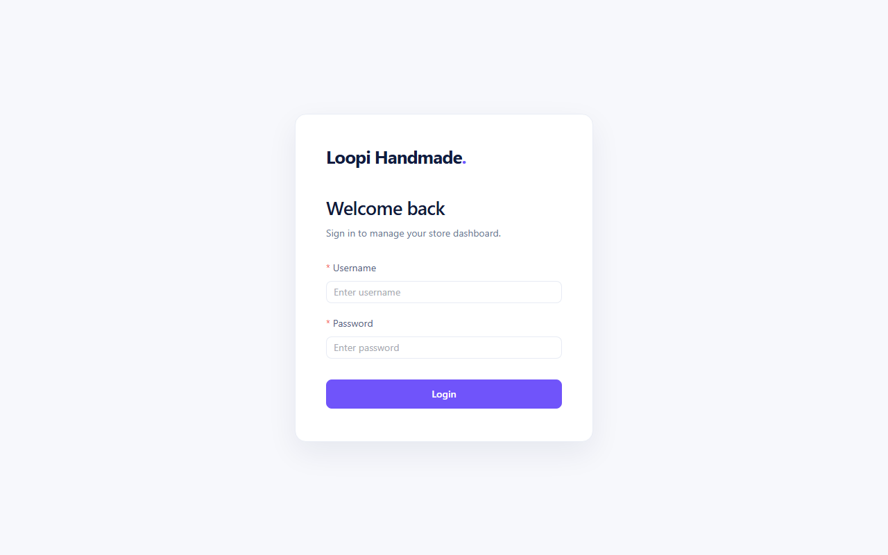

# Ecommerce Admin Dashboard

<div align="center">

Production-style ecommerce admin dashboard built with Vue 3, TypeScript, Element Plus, Pinia, Axios, ECharts, and a Vercel serverless mock API.

[](https://ecommerce-admin-dashboard-neon.vercel.app)
[](https://vuejs.org/)
[](https://www.typescriptlang.org/)
[](https://vite.dev/)
[](https://vercel.com/)

</div>



## Overview

This is a portfolio-ready admin dashboard for managing a small ecommerce storefront. It demonstrates protected routing, mock authentication, product CRUD flows, order views, dashboard metrics, chart visualization, and API integration patterns that can be deployed as a full demo on Vercel.

## Highlights

- Login flow with mock credentials and route guards
- Dashboard overview with revenue metrics, product summaries, order cards, and ECharts visualization
- Product management table with search, pagination, create, update, and delete actions
- Order management page for fulfillment-style review
- Role-aware routing using values stored in `localStorage`
- Axios request wrapper that switches between local API and Vercel `/api`
- Vercel serverless function that mirrors the local mock API endpoints

## Tech Stack

| Area | Tools |
| --- | --- |
| Framework | Vue 3, TypeScript |
| UI | Element Plus, custom dashboard CSS |
| State / Routing | Pinia, Vue Router |
| Data / API | Axios, Vercel Serverless Functions |
| Charts | ECharts |
| Build / Deploy | Vite, vue-tsc, Vercel |

## Demo

- Live site: [ecommerce-admin-dashboard-neon.vercel.app](https://ecommerce-admin-dashboard-neon.vercel.app)
- Repository: [github.com/ErrineZh/ecommerce-admin-dashboard](https://github.com/ErrineZh/ecommerce-admin-dashboard)
- Demo username: `admin`
- Demo password: `admin123`

## Run Locally

Install dependencies:

```bash
npm install
```

Start the Vue app:

```bash
npm run dev
```

For local API behavior, run a compatible mock backend on:

```text
http://localhost:3000
```

The app automatically uses `/api` in production, so the Vercel deployment works without a separate PHP server.

## API Routes

The deployed mock API lives in `api/index.ts` and supports the same dashboard flows used by the UI:

| Endpoint Path | Purpose |
| --- | --- |
| `login` | Mock admin login used by the demo account |
| `products` | Product list |
| `products-add` | Create product |
| `products-update` | Update product |
| `products-delete` | Delete product |
| `orders` | Order list |

## Production Build

```bash
npm run build
```

Preview the production build:

```bash
npm run preview
```

## Project Structure

```text
api/
  index.ts            Vercel serverless mock API
src/
  api/                Axios API modules
  components/         Shared dashboard components
  layout/             Main admin shell
  router/             Protected routes and guards
  stores/             Pinia state
  views/              Login, dashboard, products, orders
docs/
  preview.png         README preview image
```

## Notes

This project uses mock data for portfolio demonstration. For production use, connect the API layer to persistent storage, replace mock authentication with a real identity provider, and harden validation on all write endpoints.
